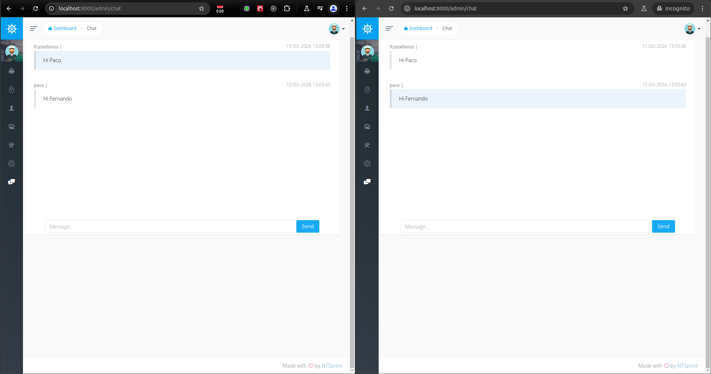

# HelpDesk System with Laravel Voyager, Laravel Reverb, and React



This is a HelpDesk system built using **Laravel 10**, **Laravel Voyager**, **Laravel Reverb**, and **React**. The application allows users to submit support tickets, track progress, and communicate with agents until the issue is resolved. The system provides a user-friendly admin dashboard powered by **Voyager** and custom **React** components and widgets for interactive management of tickets and statistics.

## Features

### 1. Ticket Management
- **Create Tickets**: Users can submit support tickets with detailed descriptions of their issues.
- **Assign Tickets**: The system assigns tickets to agents based on:
  - **Workload**: Automatically distribute tickets evenly among agents.
  - **Skills**: Assign tickets to agents who specialize in the ticket category (e.g., technical support, billing).
  - **Availability**: Prioritize agents who are active and available to take on new tickets.
- **Ticket Status**: Track tickets through various statuses (`open`, `in-progress`, `resolved`, `closed`).
- **Priority Levels**: Tickets can be prioritized (high, medium, low), with filtering options for agents to manage tasks effectively.
- **Reassignment**: Tickets can be automatically reassigned if they remain unaddressed for a set period.

### 2. Email Parsing and Ticket Creation
- **Email-to-Ticket**: Automatically create tickets from incoming emails. The system parses email subjects and bodies to extract relevant information for the ticket.
- **Subject Parsing**: Extract ticket title, priority, and problem type based on the email subject.
- **Body Parsing**: Extract detailed descriptions from the email body and attach any files to the ticket.
- **Auto-Assignment by Email**: Emails from specific domains or senders can be routed to specific teams or agents based on predefined rules.

### 3. Progress Tracking and Workflow
- **Ticket Workflow**: Visualize the lifecycle of a ticket with stages like:
  - **New**: Ticket created but not yet assigned.
  - **Assigned**: Ticket assigned to an agent.
  - **In Progress**: The agent is actively working on the ticket.
  - **Resolved**: The issue has been resolved.
  - **Closed**: The ticket has been closed by the client or admin.
- **Activity Log**: Record all actions taken on the ticket, including changes in status, assignment, and internal notes.
- **Real-Time Progress**: Use real-time indicators to show the current state and progress of each ticket in the system.
  
### 4. Notifications and Alerts
- **Real-Time Notifications**: Use **Laravel Echo** and websockets to notify agents and clients in real-time when:
  - A new ticket is created.
  - A ticket is assigned or reassigned.
  - There is an update or resolution on a ticket.
- **Email Notifications**: Clients and agents are notified via email for ticket updates, such as status changes or agent responses.

### 5. User-Friendly Admin Dashboard (Powered by React and Voyager)
- **Ticket Overview Widget**: A React-based widget displaying the list of open, pending, and resolved tickets.
- **Interactive Graphs**: Visualize ticket statistics with interactive charts (e.g., resolved vs. unresolved tickets, ticket categories, agent performance).
- **Search and Filters**: Advanced filtering options for tickets based on various parameters such as date, category, status, priority, and assigned agent.
- **Mobile-Optimized Interface**: A responsive interface that allows agents to manage tickets from any device.
  
### 6. Reporting and Analytics
- **Agent Performance Reports**: Generate reports on agent performance, such as:
  - Number of tickets resolved.
  - Average response time.
  - Average resolution time.
- **System-Wide Reports**: Create global reports showing system health, like the number of open tickets, pending tickets, and resolution rates.
- **Export Data**: Reports can be exported to formats like CSV or PDF for external analysis.

### 7. Knowledge Base and FAQ
- **Help Articles**: Agents can create and manage a knowledge base of frequently asked questions and guides.
- **Auto-Suggestions**: When users create a ticket, the system automatically suggests related articles from the knowledge base.

### 8. Ticket Feedback and Satisfaction
- **Client Feedback**: After a ticket is resolved, clients can rate the service provided by the agent.
- **Satisfaction Reports**: Collect and display feedback in the admin dashboard, showing customer satisfaction trends.

### 9. Automation and Scheduling
- **Ticket Reminders**: Set up automated reminders for tickets that remain unaddressed or unresolved after a set time.
- **Auto-Close Tickets**: Automatically close tickets that have been inactive for an extended period.

### 10. Chat System (In Progress)
- **Real-Time Chat**: The system includes a chat feature for agents and clients to communicate in real-time, improving issue resolution speed. This feature is currently under development.

### 11. User Authentication and Authorization
- **User Roles**: Users can be assigned roles such as **client**, **agent**, and **administrator**. Each role has specific access permissions within the system.
- **Role-Based Access Control**: Voyager's role system is leveraged to ensure that users only see and interact with tickets relevant to them.

## Installation

1. Clone the repository:
   ```bash
   git clone https://github.com/your-username/helpdesk-system.git
   ```

2. Install the dependencies:
    ```bash
    composer install
    npm install
    ```

3. Set up your .env file:
    ```bash
    cp .env.example .env
    php artisan key:generate
    ```

4. Run migrations:
    ```bash
    php artisan migrate
    ```

5. Start the development server:
    ```bash
    php artisan serve
    npm run dev
    ```

## Technologies Used
- **Laravel 10**
- **Laravel Voyager** (Admin dashboard)
- **Laravel Reverb** (Notifications and real-time events)
- **React** (Frontend components and widgets)
- **Laravel Echo** (Real-time notifications with websockets)
- **Chart.js / ApexCharts** (For graphs and reporting)
- **Laravel Mailbox** (Email parsing for tickets)

## Future Improvements
- Integration with third-party CRMs and billing systems.
- AI-powered suggestions for ticket resolutions.
- Advanced analytics dashboards for better data-driven decision-making.

## Current Status
- **User Authentication and Authorization**: Complete.
- **Ticket Management**: In progress.
- **Chat System**: In progress.
- **Email Parsing**: In progress.
